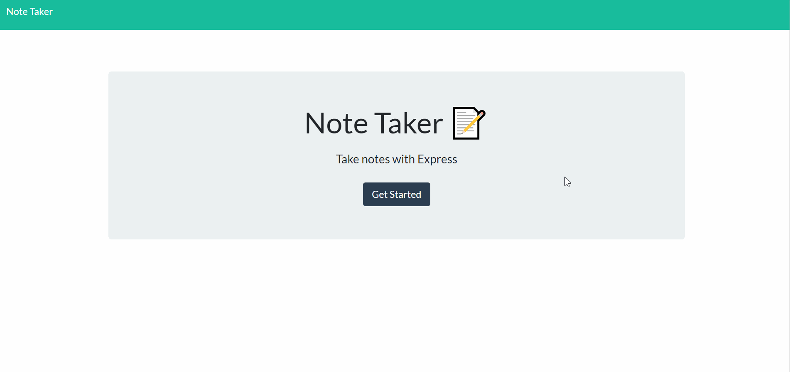

# Express Note Taker

 

### URL: https://ancient-tundra-78234.herokuapp.com/

## Description

This application can be used to write, save, and delete notes. It uses an Express backend to save and retrieve persistent note data from a JSON file.

## Table of Contents

- [Usage](#usage)
- [Credits](#Credits)
- [Questions](#questions)

## Usage

- Click "Get Started" to go to the application.
- Enter a Note Title and Note Text to create a new note.
- Click the save button in the top right corner to save the note for later.
- Delete notes using the trash can icon.

## Credits

- [express](https://www.npmjs.com/package/express)
- [fs](https://www.npmjs.com/package/file-system)
- Front end files provided by Triology

## Questions?

Contact me at [darian.nocera26@gmail.com](mailto:darian.nocera26@gmail.com)

or 

##### Copyright © 2020 [Darian Nocera](http://www.github.com/darnocer)

---

##### _Created with [darnocer's README generator](https://github.com/darnocer/Node.js-and-ES6-README-Generator)_ 👽
